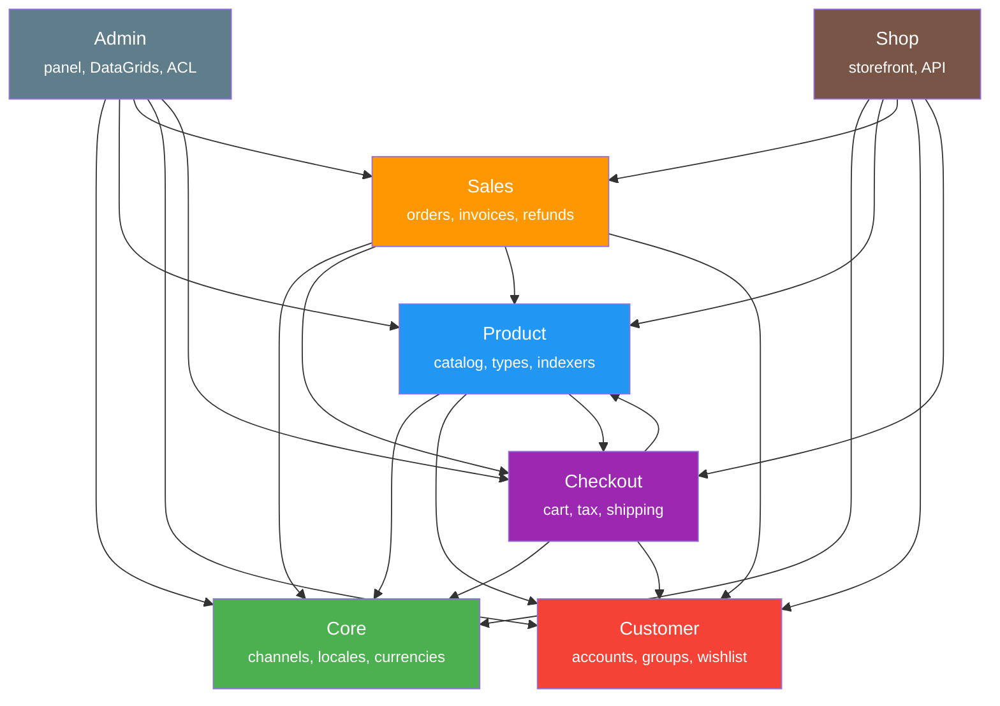
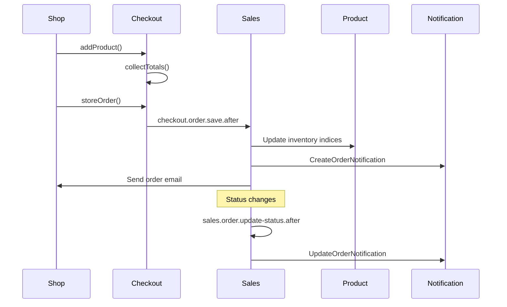

# Webkul Packages — Dependency Map

> Auto-generated specification index for all Webkul packages in `packages/Webkul/`.
> Detailed specs available for key packages (linked below).

---

## Package Overview by Domain

### Core & Foundation

| Package | Description | Depends On | Spec |
|---------|-------------|------------|------|
| **Core** | Foundation library: channels, locales, currencies, configuration, Elasticsearch, visitor tracking | — | [core-package.md](core-package.md) |
| **Attribute** | Product attributes and attribute families (EAV system) | Core | — |
| **Category** | Product category tree management | — | — |
| **DataGrid** | Reusable data grid/table system for admin panels with filtering, sorting, export | Core | — |
| **Theme** | Theme management and customization engine | — | — |
| **Installer** | Application installer and setup wizard | Attribute, Category, CMS, Core, Customer, Inventory, Shop, SocialLogin, User | — |

### Catalog & Products

| Package | Description | Depends On | Spec |
|---------|-------------|------------|------|
| **Product** | Product catalog: types (simple, configurable, grouped, bundle, constructor, ingredient), attributes, inventory, pricing, indexers, Elasticsearch | Attribute, Inventory, Category, Core, Customer, Checkout, Sales, CatalogRule, Tax, BookingProduct, Marketing | [product-package.md](product-package.md) |
| **Inventory** | Stock and inventory source management (warehouses, pickup points) | — | — |
| **BookingProduct** | Booking/reservation product type (slots, appointments) | — | — |
| **CMS** | Content management: static pages and blocks | Core | — |

### Sales & Orders

| Package | Description | Depends On | Spec |
|---------|-------------|------------|------|
| **Sales** | Order lifecycle: orders, invoices, shipments, refunds, transactions, order status workflow | Core, Checkout, Product, Customer, Inventory, Shop | [sales-package.md](sales-package.md) |
| **Checkout** | Shopping cart, address management, shipping rates, tax calculation, coupon application | Core, Product, Customer, Shipping, Tax, AlfabankPayment | [checkout-package.md](checkout-package.md) |
| **Shipping** | Shipping methods framework and rate calculation | — | — |
| **Tax** | Tax categories, rates, and calculation engine | — | — |

### Customer & Auth

| Package | Description | Depends On | Spec |
|---------|-------------|------------|------|
| **Customer** | Customer accounts, groups, addresses, wishlist, compare, notes, captcha, VAT validation | — | [customer-package.md](customer-package.md) |
| **User** | Admin users, roles, and permissions (bouncer) | Core, Admin | — |
| **SocialLogin** | Social authentication (Google, Facebook, etc.) | — | — |
| **GDPR** | GDPR compliance: data export, deletion requests, cookie consent | Core, Customer | — |

### Storefront & Admin

| Package | Description | Depends On | Spec |
|---------|-------------|------------|------|
| **Admin** | Admin panel: controllers, DataGrids, ACL, menus, routes, views, reporting, AI assistant | Core, Product, Customer, Sales, Attribute, Category, Inventory, CMS, Checkout, CartRule, Tax, User, Notification, BookingProduct | [admin-package.md](admin-package.md) |
| **Shop** | Storefront: product browsing, customer auth, cart, checkout, email notifications, API endpoints | Core, Product, Customer, Sales, Checkout, Attribute, Category, Shipping, Payment, Tax, Theme, CartRule, Marketing, BookingProduct, GDPR, MagicAI, Bonus, RestApi | [shop-package.md](shop-package.md) |

### Promotions & Marketing

| Package | Description | Depends On | Spec |
|---------|-------------|------------|------|
| **CartRule** | Shopping cart promotion rules and coupon management | Core, Rule | — |
| **CatalogRule** | Catalog price rules (automatic discounts on product catalog) | Core, Rule, Attribute, Category, Tax, Customer, Product, Admin | — |
| **Rule** | Base condition rule builder (shared by CartRule and CatalogRule) | — | — |
| **Marketing** | URL rewrites, search terms, search synonyms, SEO tools | — | — |
| **Sitemap** | XML sitemap generation for SEO | Core, Product, Category, CMS, Marketing | — |
| **SocialShare** | Social media sharing buttons for products | — | — |

### Notifications & Communication

| Package | Description | Depends On | Spec |
|---------|-------------|------------|------|
| **Notification** | Real-time system notifications for orders and products (WebSocket) | Core, Sales, Product | — |
| **Newsletters** | Newsletter subscription and campaign management | — | — |
| **PushNotification** | Push notification feature for mobile/web | — | — |

### Payments

| Package | Description | Depends On | Spec |
|---------|-------------|------------|------|
| **Payment** | Payment methods framework (cash on delivery, money transfer) | Core, Checkout, Sales | — |
| **Paypal** | PayPal payment gateway integration (Standard, Smart Button) | — | — |
| **AlfabankPayment** | Alfabank acquiring payment integration with saved cards | — | — |
| **TochkaPayment** | Tochka Bank payment integration | — | — |

### Integrations & Tools

| Package | Description | Depends On | Spec |
|---------|-------------|------------|------|
| **IikoIntegration** | iiko POS/delivery system integration (nomenclature import, order sync) | — | — |
| **RestApi** | REST API endpoints for mobile apps and external systems | — | — |
| **MobileApp** | Mobile app configuration and settings | Core, Attribute, Category, CMS, Payment, Product, Shipping | — |
| **MagicAI** | AI-powered content and image generation (OpenAI) | — | — |
| **DataTransfer** | Data import/export (products, customers, categories) | — | — |

### Reporting & Debug

| Package | Description | Depends On | Spec |
|---------|-------------|------------|------|
| **Reporting** | Analytics and reporting dashboard (sales, products, customers) | — | — |
| **FPC** | Full Page Cache system for performance optimization | Product, Sales, Category, CMS, Marketing, Theme | — |
| **DebugBar** | Development debugging toolbar (Laravel Debugbar integration) | — | — |

### Loyalty

| Package | Description | Depends On | Spec |
|---------|-------------|------------|------|
| **Bonus** | Bonus/loyalty program (points accumulation and spending) | — | — |

---

## Dependency Graph (Key Packages)

---

## Event Flow Between Packages

---

## Shared Patterns

All packages follow these conventions:

| Pattern | Description |
|---------|-------------|
| **Concord Module** | Each package registers via `CoreModuleServiceProvider` with model proxies |
| **Repository Pattern** | All data access via `Webkul\Core\Eloquent\Repository` (extends Prettus) |
| **Proxy Models** | Every model has a `*Proxy` class for dependency injection flexibility |
| **Contract Interfaces** | Marker interfaces in `Contracts/` directory for each model |
| **Event System** | `before`/`after` events on all CRUD operations (e.g., `catalog.product.create.before/after`) |
| **Translation** | Multi-locale via `Astrotomic\Translatable` package |
| **Factories** | Test factories for all key models |
| **PSR-4 Autoload** | `Webkul\{Package}\` → `src/` |
